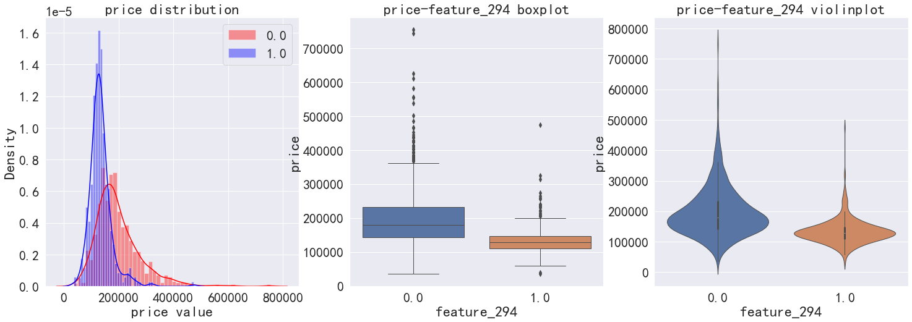
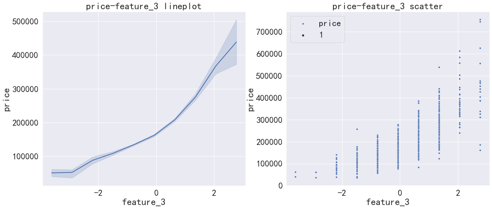
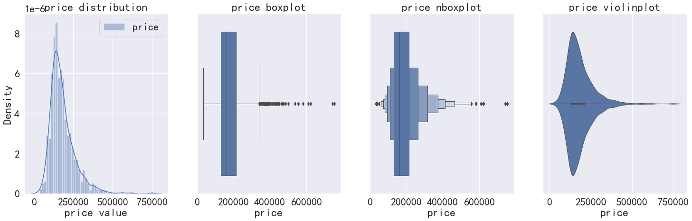
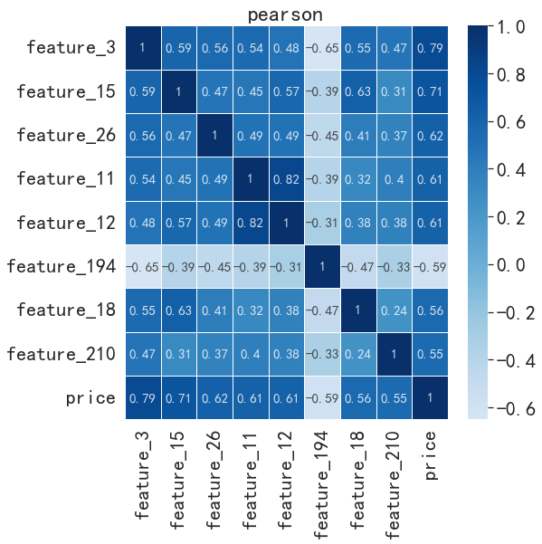
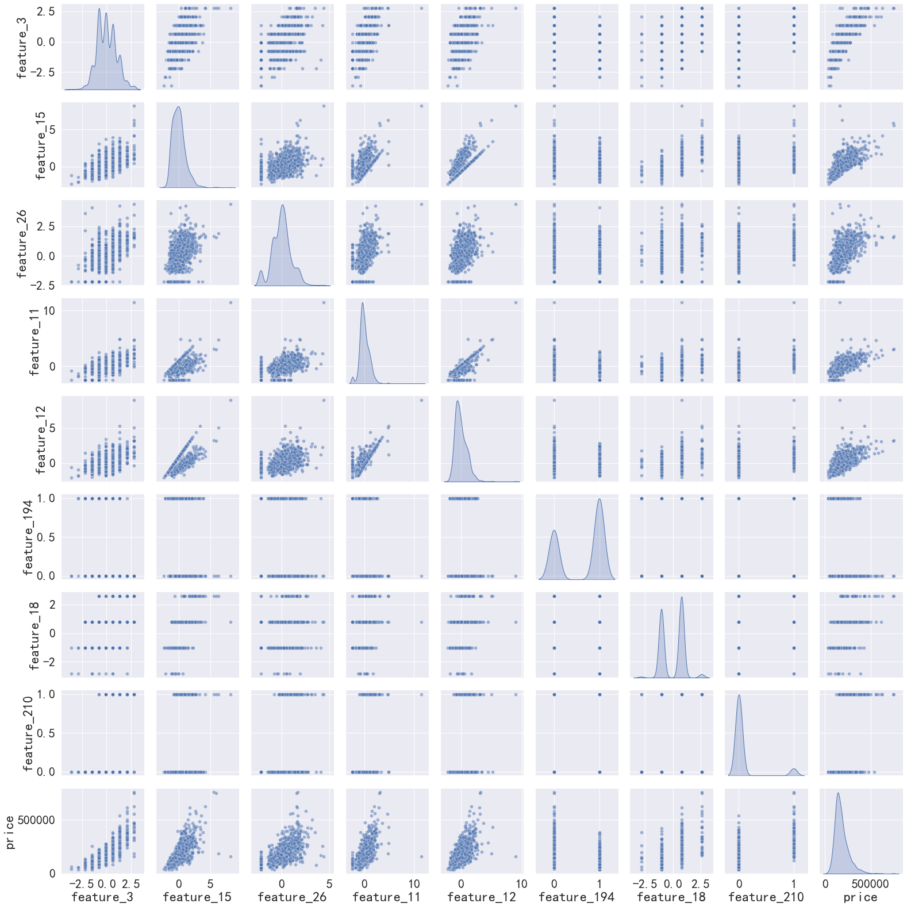
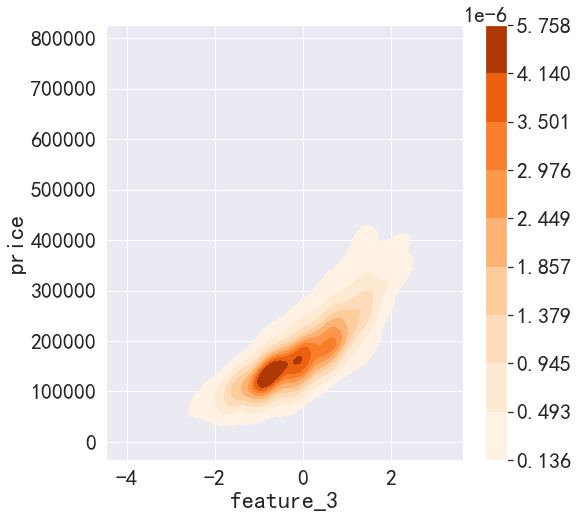
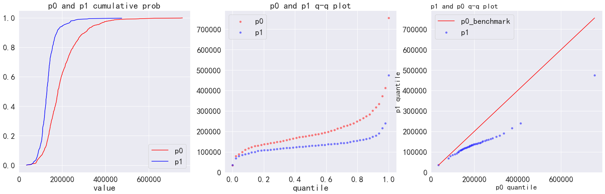
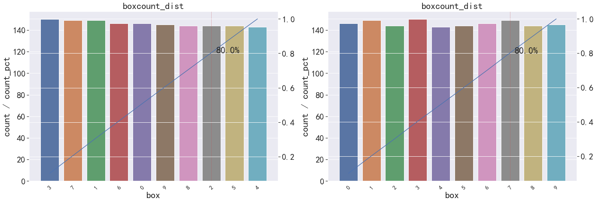
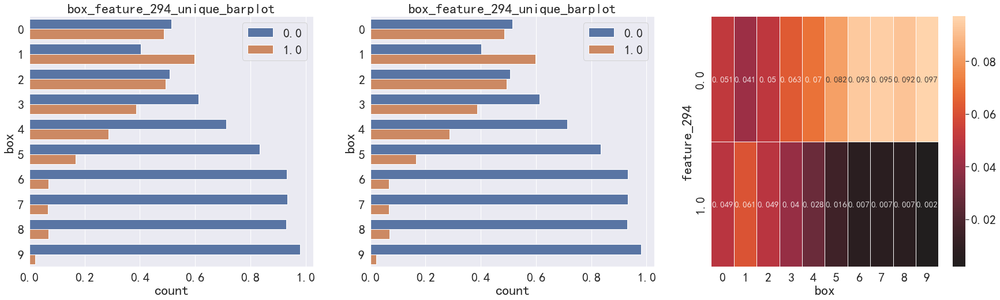
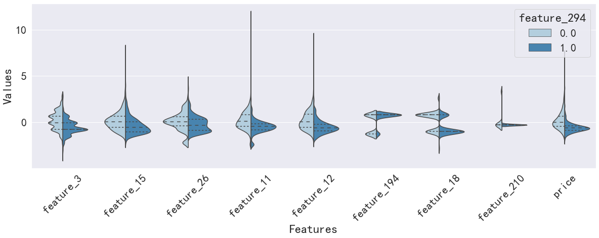

# 开发3：Autoplot绘图类介绍
## 一.介绍
&emsp;&emsp;该项目适用于特征探索阶段进行可视化分析，针对业务场景寻找一些know how，以进行下一步特征工程。  
&emsp;&emsp;可视化分析常用绘图命令繁琐，特别是当存在多种应用场景时，代码迁繁琐，为此项目主要开发多个场景的快速会图命令:
1. 数值变量分析：单个数值变量分布、数值变量在分类变量或时序下的分布、数值变量与数值变量的联合分布关系
2. 分类变量分析：单个分类变量分布统计，两个分类变量交叉分布统计
3. 其他：单个分类变量对多个数值变量的影响  
**以上为目前的使用场景，后续出现新的场景将持续补充**  
**使用方法和demo可以参考文件`auto_plot示范.ipynb`**
## 二.使用方法
###2.1 实例化AutoPlot
&emsp;&emsp;实例化只需要指定图片存储路径save_path，按照指定的格式进行定义即可，其他预设的参数一般不需要修改，可以参照__init__方法进行调整
```python
### 实例化绘图类
save_path = r'./{}_{}.{}' # {}固定图片保存格式
autoPlot = AutoPlot(save_path=save_path)
```
###2.2 初始化画布
&emsp;&emsp;本方案绝大部分绘图方法调用的基本流程都是初始化画布和子图，调用autoPlot绘图方法，在方法中传入子图和其他参数即可。
初始化画布一般使用`plt.subplots(**parms)`进行定义。
```python
import matplotlib.pyplot as plt
fig, axe = plt.subplots(1,3, figsize=(20,7))
plt.subplots_adjust(wspace=0.3) # 按需调整子图样式
```
###2.3 调用相关方法
&emsp;&emsp;autoPlot的绘图方法调用风格一致，以下以单个数值变量在分类变量下的分布进行示范。  
1.首先确定特征-标签数据集，必须是dataframe格式（df）  
2.确定需要分析的数值变量列名num_name，分类变量列名cat_name  
3.确定想要可视化的形式：kde or box or violin  
一般autoPlot方法调用的传参形式为`autoPlot.func(df, num_name, cat_name, axe_type=建立的子图, **parms)`。
即只需要传入dataframe的一些信息，子图画布，及其他定制化参数即可。  
示例：绘制不同分布只需要将子图axe传入对应的画布类型：
```python
fig, axe = plt.subplots(1,3,figsize=(25,8))
autoPlot.num_seq_plot(df, num_name='price', seq_name='feature_294', ax_kde=axe[0])
autoPlot.num_seq_plot(df, num_name='price', seq_name='feature_294', ax_box=axe[1])
autoPlot.num_seq_plot(df, num_name='price', seq_name='feature_294', ax_vln=axe[2])
```
结果展示：

进一步查看数值变量在某个序列变量下的分布，同样只需要指定相关dataframe，列名和画布即可：
```python
# 序列变量下的分布 散点 or 折线，适用于时序可视化
fig, axe = plt.subplots(1,2,figsize=(20,8))
autoPlot.num_seq_plot(df, num_name='price', seq_name='feature_3', ax_line=axe[0]) # 折线
autoPlot.num_seq_plot(df, num_name='price', seq_name='feature_3', ax_sca=axe[1])  # 散点 
```
绘图结果展示：


###三. 其他可视化场景展示
###3.1 单数值变量分布


###3.2 多个数值变量分布关系
**相关性热力图**


**pair plot配对分布图**


###3.3 两个数值变量2d分布密度


###3.4 两个数值变量qq图对比


###3.5 单个分类变量分布统计


###3.6 两个个分类变量交叉分布统计


###3.7 一个分类变量对多个数值变量的区分（二分类场景）
